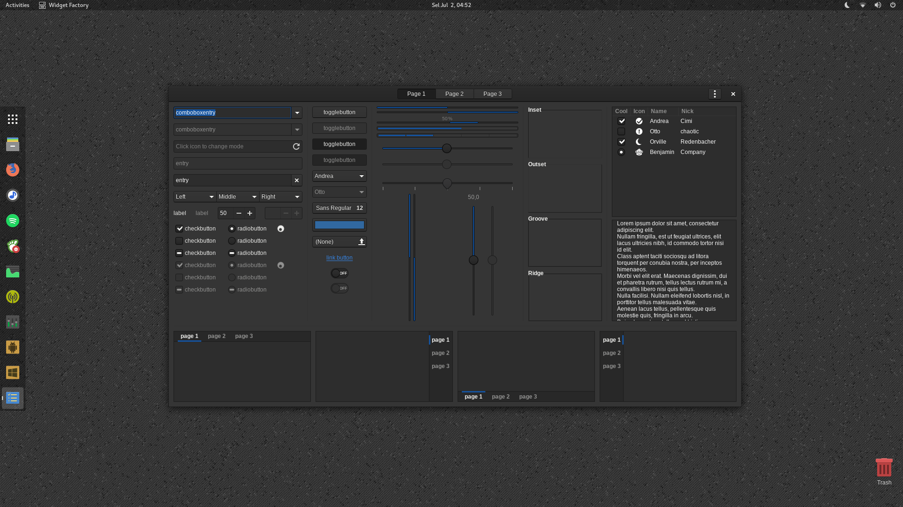
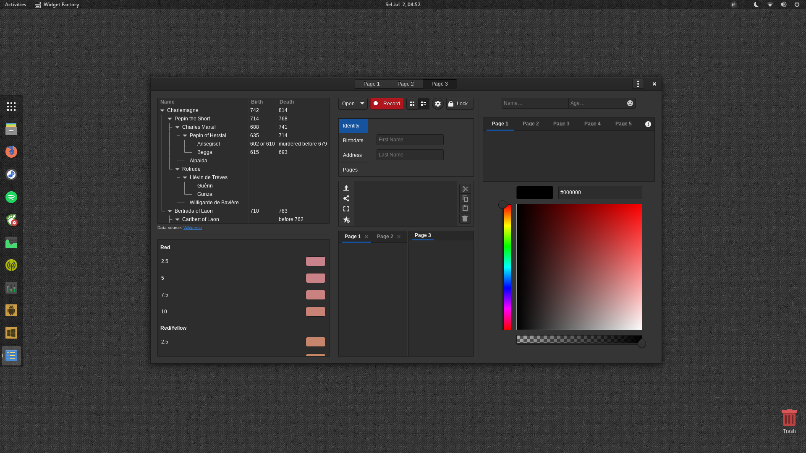

# Atiawda
Compact version of Adwaita theme.

## Preview




## Requirements

- GTK `>=3.20`
- `gnome-themes-extra` (or `gnome-themes-standard`)
- Murrine engine — The package name depends on the distro.
  - `gtk-engine-murrine` on Arch Linux
  - `gtk-murrine-engine` on Fedora
  - `gtk2-engine-murrine` on openSUSE
  - `gtk2-engines-murrine` on Debian, Ubuntu, etc.
- `make` — build dependency
- `sassc` — build dependency

## Install

Run the following commands in the terminal:

```sh
$ git clone https://github.com/SeptianTux/Atiawda.git
$ cd Atiawda
$ make install # Use sudo if you want to install it to /usr/share/themes
```

## Uninstall

Run the following commands in the terminal:
```sh
$ make uninstall # Use sudo if you install it in /usr/share/themes
```

## Recommendations

### Font


## Upstream theme sources

- [GTK 3](https://gitlab.gnome.org/GNOME/gtk/tree/gtk-3-24/gtk/theme/Adwaita) (3.24)
- [GTK 2](https://gitlab.gnome.org/GNOME/gnome-themes-extra/tree/master/themes/Adwaita/gtk-2.0)
- [GNOME Shell](https://gitlab.gnome.org/GNOME/gnome-shell/tree/master/data/theme)
  - [Sass sources](https://gitlab.gnome.org/GNOME/gnome-shell-sass) (legacy)
